# **Agroservicio**

## ¿Cómo Acceder al Sistema?

### Ejecutar las migraciones

Desde la terminal debe de ejecutar el comando:

    php artisan migrate

### Descargar .sql

Para poder iniciar sesión en el sistema, deberá de ingresar los 3 tipos de usuarios y los triggers con las conversiones.

Lo puede descargar en el siguiente enlace:

[Trigger.sql](https://drive.google.com/file/d/1Hh0nb33qvhZO_otG9MDh34s7Wn_0tPMD/view?usp=share_link)

### Crear la base de datos

El nombre de la base de datos es:
_bd_agroservicio_

Luego debe ejecutar el contenido del archivo **Trigger.sql**

## Correr el Servidor

Desde la terminal debe de ejecutar el comando:

    php artisan serve

Este lo va dirigir a la ruta de inicio de sesión.

## Crear usuario

Pero antes debemos de crear el usuario, entrando a la ruta

    /registrar

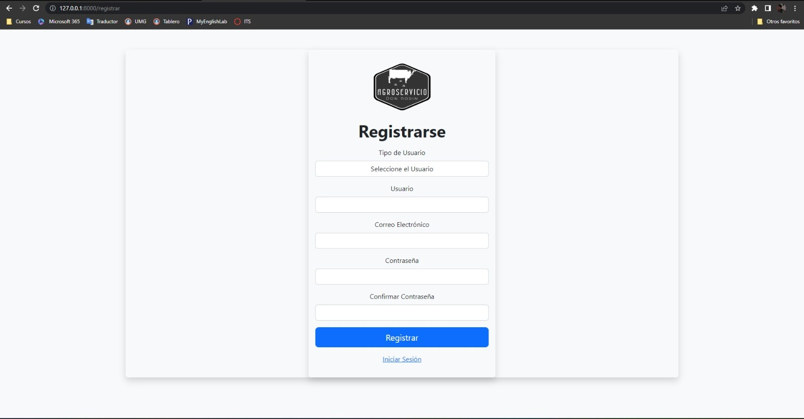

Luego lo va a redirigir al inicio de sesión y ya puede acceder a la información del sistema

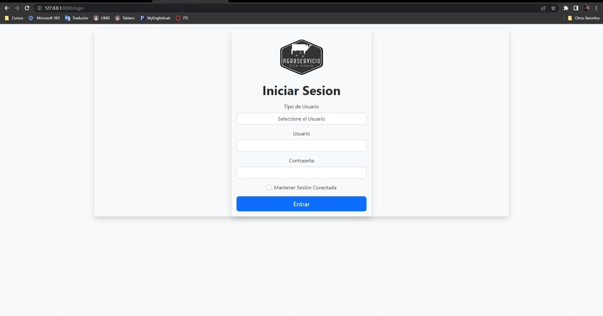

## Módulos Creados:

### Inicio

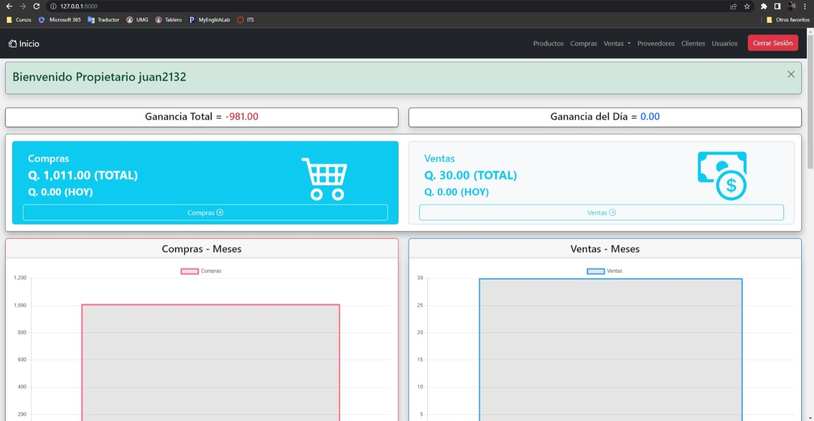

### Productos

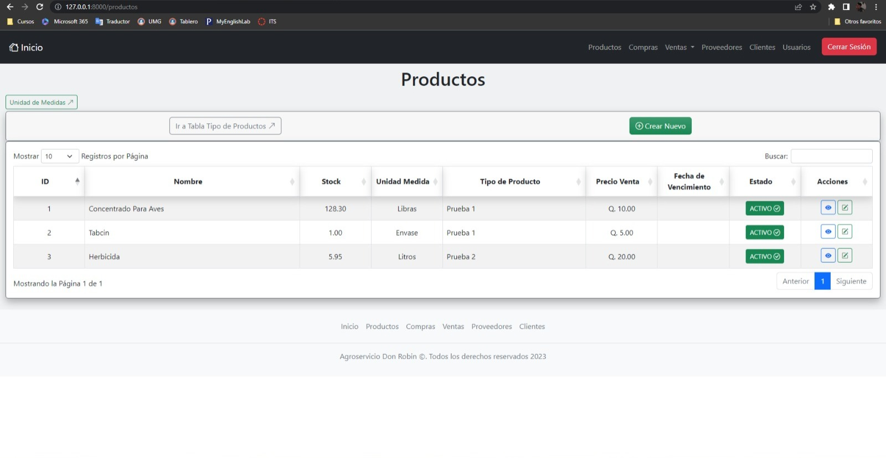

### Unidades de Medida

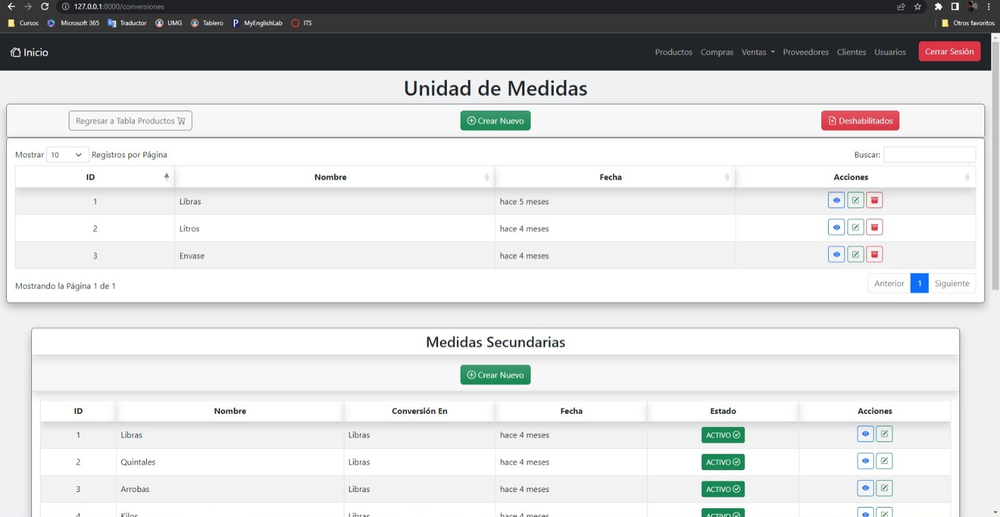

### Compras

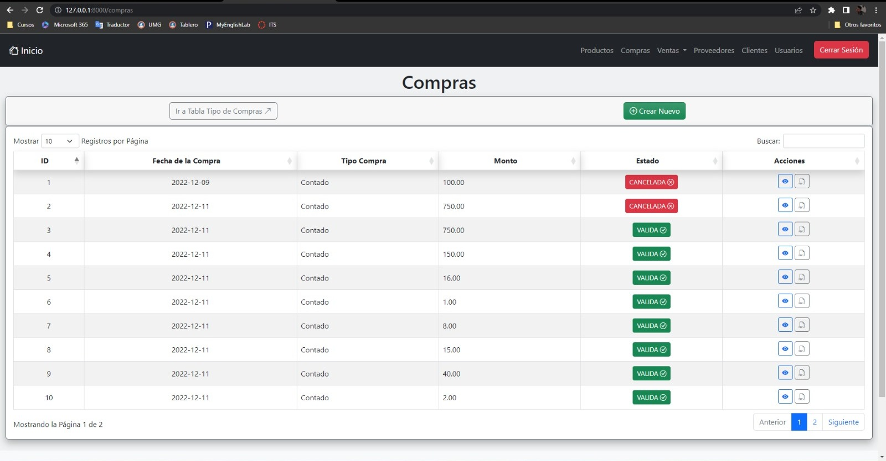

### Ventas

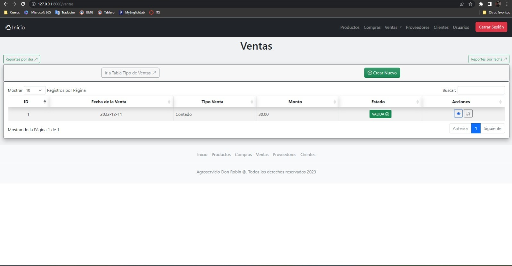

### Reporte de Ventas

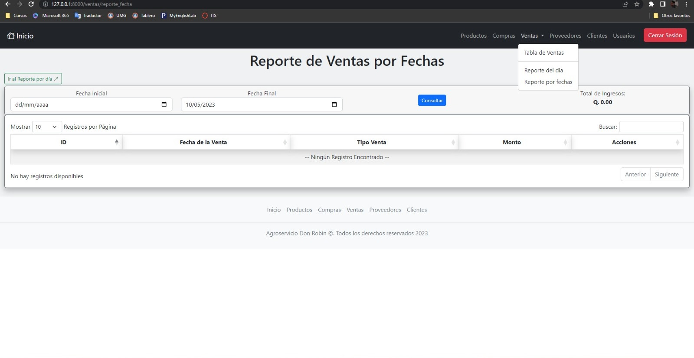

### Proveedores

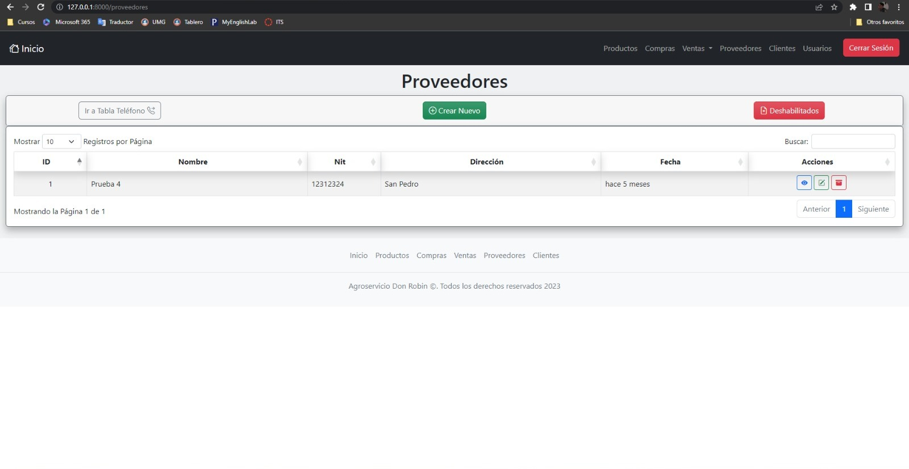

### Clientes

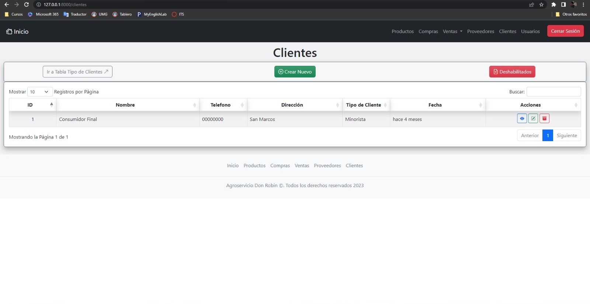

### Usuarios

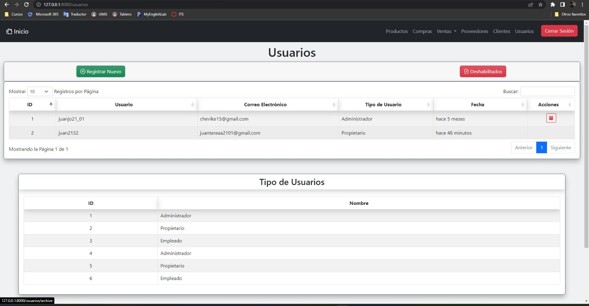
